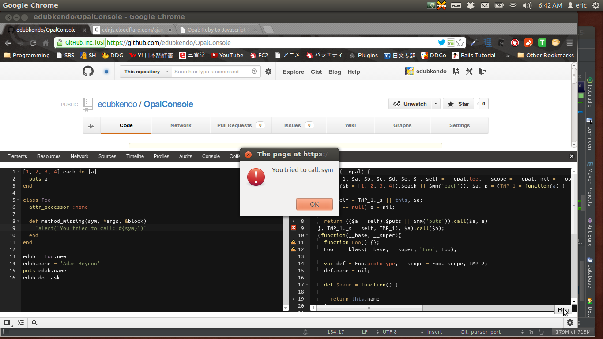

Run an Opal Console from the Chrome DevTools. View the compiled Javascript and execute it. We inject a copy of Opal.js into the page to make this work. However, it is injected prior to any other script, so if you already have Opal on the page, your Opal should replace ours.

To install, simply open chrome://extensions and drag and drop the .crx file onto the page.

This tool was directly inspired by, and much of the code lifted from: [The CoffeeConsole](https://chrome.google.com/webstore/detail/coffeeconsole/ladbkfdlnaibelfidknofapbbdlhadfp).

